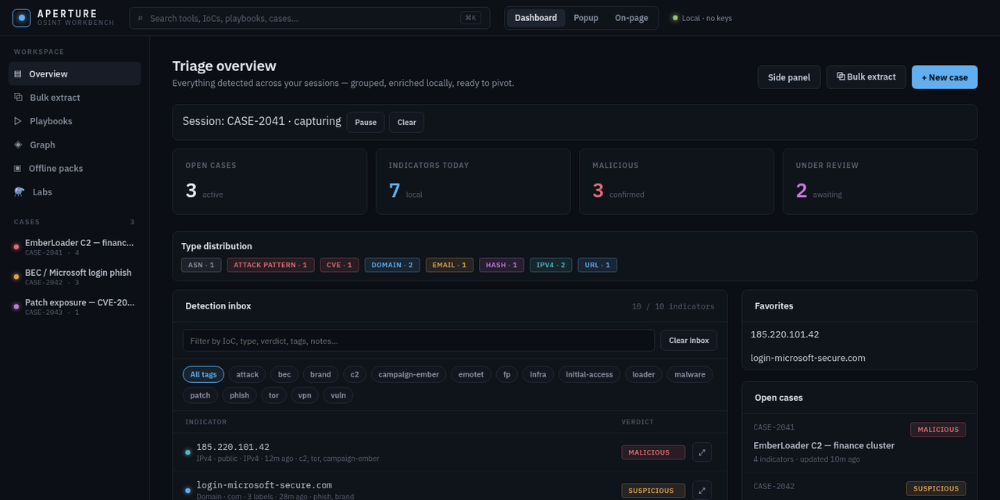

# Aperture — OSINT Workbench

<p align="center">
  
</p>

**Local-first browser extension** for SOC, DFIR, and CTI analysts.

Aperture detects indicators of compromise in the browser, orchestrates pivots to public OSINT sites, and keeps cases, history, and playbooks on-device. Core use requires **no API keys, no accounts, and no telemetry**.

| | |
|---|---|
| **Version** | 4.0.0 (Manifest V3) |
| **Browsers** | Firefox 140+ · Chrome / Chromium |
| **Firefox Add-ons** | [addons.mozilla.org/…/soc-osint-extension](https://addons.mozilla.org/en-GB/firefox/addon/soc-osint-extension/) |
| **License** | [MIT](LICENSE) |
| **Formerly** | SOC OSINT Search |

<p align="center">
  
</p>

<p align="center"><em>Dashboard triage overview (demo data for illustration)</em></p>

---

## Why Aperture

Most OSINT “extensions” are thin wrappers around cloud APIs. Aperture is built as an **investigation companion**:

- Parse and classify IoCs **locally**
- Open public tool UIs only when **you** choose
- Capture work into **cases** and **playbooks** without sending data to a vendor
- Stay readable for store review and forks — **no build step**, no bundler, plain HTML/CSS/JS

Optional **Labs** features (local LLM, API enrichment, experimental tools) are **off by default**.

---

## Features

- **Popup launcher** — paste an indicator, classify locally, run tools or playbooks
- **Dashboard workbench** — triage inbox, bulk extract, cases, playbooks, relationship graph, offline packs, Labs
- **Playbooks** — ordered multi-tool workflows; share codes (`APX|…`); delay / concurrency / skip-private-IP options
- **Cases** — indicators, verdicts, tags, notes, timeline, session capture, JSON / Markdown / CSV export
- **On-page detect** (opt-in) — highlight IoCs; pivot card with notes, tags, clipboard packs, related IoCs
- **Side panel page** — compact investigation surface (tab everywhere; Chrome `sidePanel` API when available)
- **Context menu** — right-click selection → playbooks and services
- **Command palette** — ⌘/Ctrl+K on extension pages; Ctrl+Shift+K / Ctrl+Shift+O browser commands

### Indicator types

IPv4/IPv6, domains, URLs, emails, MD5/SHA-1/SHA-256, CVEs, BTC, ASNs, plus ETH, ATT&CK technique IDs, JA3/JARM-style labels, file paths, onion addresses, Telegram/Discord links, and additional Labs/wave-2 types.

### Public OSINT pivots

VirusTotal, AbuseIPDB, URLScan, Shodan, Censys, AlienVault OTX, ThreatCrowd, IBM X-Force Exchange, MalwareBazaar, GreyNoise, Spur, Have I Been Pwned, crt.sh, RDAP, Wayback Machine, URLhaus, ThreatFox, NVD, BGP HE, MITRE ATT&CK.

---

## Install (end users)

### Firefox

Install from [Firefox Browser Add-ons](https://addons.mozilla.org/en-GB/firefox/addon/soc-osint-extension/), or load temporarily:

1. `about:debugging` → This Firefox → **Load Temporary Add-on**
2. Select [`extension/manifest.json`](extension/manifest.json)

### Chrome / Chromium

1. `chrome://extensions` → enable **Developer mode**
2. **Load unpacked** → select the [`extension/`](extension/) folder

---

## Privacy

- Parsing and enrichment run **on-device**
- Network use is limited to **tabs you open** to public OSINT sites (unless you enable opt-in Labs adapters / local LLM)
- On-page highlights are **off by default**
- Firefox `data_collection_permissions`: **none**
- Host access (`<all_urls>`) supports context-menu selection and optional page highlights

---

## Develop / fork

This project is intentionally **zero-build** so reviewers and contributors can read shipped files as-is.

### Load for development

Same steps as Chrome/Firefox “load unpacked / temporary add-on” above. Edit a file, reload the extension.

### Repository layout

| Path | Purpose |
|---|---|
| [`extension/`](extension/) | Extension runtime — load this folder as the unpacked add-on |
| [`docs/`](docs/) | Guides, store checklists, [release notes](docs/releases/) |
| [`test/`](test/) | Detection corpus and manual test pages |
| [`preview/`](preview/) | README / social-preview demo dashboard (not shipped) |
| [`design/`](design/) | Design prototypes (not shipped) |
| [`scripts/`](scripts/) | Packaging (`scripts/package.sh`) |
| [`.github/`](.github/) | Social preview asset |

### Extension entry points

| Surface | Files |
|---|---|
| Manifest | [`extension/manifest.json`](extension/manifest.json) |
| Background | [`extension/background.js`](extension/background.js), [`extension/ioc-utils.js`](extension/ioc-utils.js) |
| Popup | [`extension/popup.html`](extension/popup.html) |
| Dashboard | [`extension/dashboard.html`](extension/dashboard.html) |
| On-page | [`extension/content.js`](extension/content.js), [`extension/content.css`](extension/content.css) |
| Side panel | [`extension/sidepanel.html`](extension/sidepanel.html) |
| Shared UI | [`extension/aperture.css`](extension/aperture.css), [`extension/palette.js`](extension/palette.js), `extension/fonts/` |
| Offline packs / flags / IDB | `extension/aperture-packs.js`, `aperture-features.js`, `aperture-store.js` |
| DevTools (experimental) | [`extension/devtools.html`](extension/devtools.html) |

### Package a release zip

```bash
./scripts/package.sh
# or: ./package-for-firefox.sh
# → aperture-osint-v4.0.0.zip (extension runtime only)
```

### Tests & preview

```bash
# Detection corpus
open test/test-ioc-utils.html

# Manual checklist
# docs/TESTING_GUIDE.md

# Dashboard screenshot fixture (demo data)
python3 -m http.server 8765 --bind 127.0.0.1
# → http://127.0.0.1:8765/preview/dashboard-preview.html
```

### Extending

Common fork points:

- **New OSINT site** — add URL template in `extension/background.js` (`serviceUrls`) and map it in `IOCUtils.toolsFor()`
- **New IoC type** — extend detection in `extension/ioc-utils.js` and cover it in `test/test-ioc-utils.js`
- **New playbook** — create in the UI or import an `APX|…` share code
- **Labs / experimental behaviour** — feature flags via the dashboard **Labs** screen (`extension/aperture-features.js`)

Keep the privacy model: network only on explicit user action; keys never in `storage.sync`; experimental features default off.

---

## Version history

| Version | Notes |
|---|---|
| [4.0.0](docs/releases/RELEASE_NOTES_v4.0.0.md) | Workbench expansion: cases/inbox depth, session capture, graph, offline packs, Labs, broader detection |
| [3.1.x](docs/releases/RELEASE_NOTES_v3.1.1.md) | Detection accuracy, playbook delete, always-refang |
| [3.0.0](docs/releases/RELEASE_NOTES_v3.0.0.md) | Aperture rebrand, MV3, playbooks, cases, palette |

---

## Contributing

Issues and pull requests are welcome.

1. Fork the repository and create a focused branch
2. Prefer small, reviewable diffs that match existing vanilla JS style
3. Add or extend tests in `test/test-ioc-utils.js` when changing detection
4. Do not add a bundler, telemetry, or mandatory cloud dependency without discussion

If you are adapting Aperture for an organisation (MISP, OpenCTI, custom tools), keep org-specific connectors behind explicit opt-in flags.

---

## Security

This extension requests broad host access for optional page highlights. Treat loaded code as trusted. Report security issues privately via GitHub Security Advisories on this repository when available, or open a minimal issue without exploit detail.

---

## License

[MIT](LICENSE) — © 2025–2026 Aperture / petstuk contributors.
